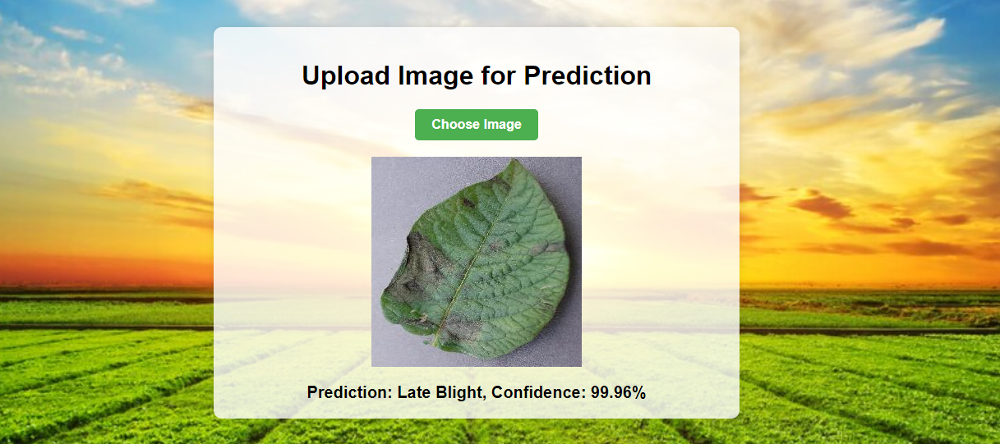

# Plant Disease Classification

This project involves building a convolutional neural network (CNN) to detect diseases in potato plants. The model classifies potato leaves into three categories: healthy, early blight, and late blight. The entire project is structured into three main parts: building the model, creating an API and a simple web page, and deploying the application on an AWS EC2 machine.

## Table of Contents
- [Introduction](#introduction)
- [Testing](#Testing)
- [Dataset](#dataset)
- [Model Building](#model-building)
- [API and Web Page](#api-and-web-page)
- [Deployment](#deployment)
- [Usage](#usage)

## Introduction
Potato plants are susceptible to two main types of diseases: early blight and late blight. These diseases can be detected by experts examining the leaves. This project aims to automate this process using a convolutional neural network (CNN) to classify images of potato leaves.

## Testing
You can test the model directly using the web page deployed in the EC2 machine using the link below and images provided in **Test samples** folder.
[EC2 Instance Link](http://ec2-13-60-27-183.eu-north-1.compute.amazonaws.com:8000/)



## Dataset
The dataset consists of 2152 images categorized into three classes:
- Healthy
- Early Blight
- Late Blight

you can access the dataset in kaggle [Dataset link](https://www.kaggle.com/datasets/arjuntejaswi/plant-village)
## Model Building
The model is built using TensorFlow and comprises the following layers:
1. Resize and Rescale layer
2. Six convolutional blocks, each containing:
   - Conv2D layer with ReLU activation
   - MaxPooling2D layer
3. Flatten layer
4. Dense layer with ReLU activation
5. Output Dense layer with softmax activation for classification

The model is designed to handle variance in image shapes using data augmentation techniques.


## API and Web Page
A FastAPI application is created to serve the model. A simple HTML and CSS web page allows users to upload images and receive predictions.

### Features:
- Upload image button
- Display uploaded image
- Display prediction results

## Deployment
The application is deployed on an AWS EC2 t3.micro instance. You can test the model using the following link and the provided testing samples in the repository:

[EC2 Instance Link](http://ec2-13-60-27-183.eu-north-1.compute.amazonaws.com:8000/)

## Usage
1. Clone the repository:
   ```bash
   git clone https://github.com/omarhassan97/plant-disease-classification.git
   cd plant-disease-classification

2. Install the required dependencies:
   ```bash
   pip install -r requirements.txt

3. uvicorn main:app --reload
    ```bash
    uvicorn main:app --reload
4. Open your browser and navigate to http://localhost:8000/ to access the web page.


